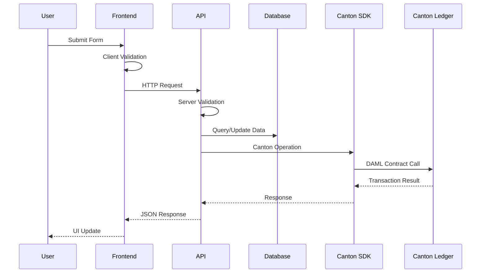

# Technical Documentation - Canton Network Tokenization Demo

## Table of Contents
2. [System Design](#system-design)
3. [Frontend Architecture](#frontend-architecture)
4. [Backend Architecture](#backend-architecture)
5. [Database Schema](#database-schema)
6. [API Specifications](#api-specifications)
7. [Canton SDK Integration](#canton-sdk-integration)
8. [Security Implementation](#security-implementation)
9. [Error Handling](#error-handling)
10. [Performance Considerations](#performance-considerations)
11. [Testing Strategy](#testing-strategy)
12. [Deployment Architecture](#deployment-architecture)

## Architecture Overview

### High-Level Architecture

```
┌─────────────────┐    ┌─────────────────┐    ┌─────────────────┐
│   Frontend      │    │   Backend       │    │   Canton        │
│   (Next.js)     │◄──►│   (API Routes)  │◄──►│   Network       │
│                 │    │                 │    │                 │
│ • React Pages   │    │ • REST APIs     │    │ • DAML Contracts│
│ • Form Handling │    │ • Validation    │    │ • Ledger        │
│ • State Mgmt    │    │ • Business Logic│    │ • Participants  │
└─────────────────┘    └─────────────────┘    └─────────────────┘
         │                       │                       │
         │                       │                       │
         ▼                       ▼                       ▼
┌─────────────────┐    ┌─────────────────┐    ┌─────────────────┐
│   UI Components │    │   Database      │    │   Smart         │
│   (shadcn/ui)   │    │   (PostgreSQL)  │    │   Contracts     │
│                 │    │                 │    │   (CIP0056)     │
│ • Forms         │    │ • User Data     │    │ • Token Logic   │
│ • Tables        │    │ • Transactions  │    │ • Compliance    │
│ • Navigation    │    │ • Holdings      │    │ • Governance    │
└─────────────────┘    └─────────────────┘    └─────────────────┘
```

### Technology Stack

| Layer | Technology | Purpose |
|-------|------------|---------|
| Frontend | Next.js 14+ | React framework with App Router |
| UI Library | shadcn/ui + Tailwind CSS | Component library and styling |
| Backend | Next.js API Routes | Server-side API endpoints |
| Database | PostgreSQL + Prisma | Data persistence and ORM |
| Blockchain | Canton Network | Distributed ledger technology |
| Smart Contracts | DAML | Contract language for Canton |
| Validation | Zod | Schema validation library |
| Type Safety | TypeScript | Static type checking |

## System Design

### Component Interaction Flow



### Data Flow Architecture

```
User Input → Form Validation → API Endpoint → Business Logic → Database Update → Canton Network → DAML Contract → Ledger Update
     ↑                                                                                                                    ↓
UI Update ← JSON Response ← API Response ← Transaction Result ← Canton SDK ← Contract Response ← Ledger Confirmation
```

## Frontend Architecture

### Next.js App Router Structure

```
src/app/
├── layout.tsx                 # Root layout with navigation
├── page.tsx                   # Onboarding page (/)
├── create-token/
│   └── page.tsx              # Token creation (/create-token)
├── mint/
│   └── page.tsx              # Token minting (/mint)
├── transfer/
│   └── page.tsx              # Token transfer (/transfer)
├── holdings/
│   └── page.tsx              # Holdings view (/holdings)
├── burn/
│   └── page.tsx              # Token burning (/burn)
└── api/                      # API routes
    ├── onboard/route.ts
    ├── tokens/route.ts
    ├── mint/route.ts
    ├── transfer/route.ts
    ├── holdings/route.ts
    └── burn/route.ts
```

### Component Architecture

```typescript
// Component Hierarchy
App Layout
├── Navigation Component
│   ├── Desktop Navigation
│   └── Mobile Navigation (Hamburger Menu)
├── Main Content Area
│   ├── Page-Specific Components
│   │   ├── Form Components
│   │   ├── Data Display Components
│   │   └── Action Components
│   └── Shared UI Components
│       ├── Cards
│       ├── Buttons
│       ├── Inputs
│       ├── Tables
│       └── Dialogs
└── Toast Notifications
```

### State Management Strategy

```typescript
// Form State Management with React Hook Form
interface FormState {
  data: FormData;
  errors: FieldErrors;
  isSubmitting: boolean;
  isValid: boolean;
}

// Component State Management
interface ComponentState {
  loading: boolean;
  data: any[];
  error: string | null;
  selectedItems: string[];
}

// Global State (if needed)
interface GlobalState {
  user: User | null;
  tokens: Token[];
  holdings: Holding[];
}
```

### Form Validation Architecture

```typescript
// Zod Schema Definition
const schema = z.object({
  field: z.string().min(1, 'Required'),
  amount: z.string().refine(val => !isNaN(Number(val)) && Number(val) > 0)
});

// React Hook Form Integration
const form = useForm<FormData>({
  resolver: zodResolver(schema),
  defaultValues: {}
});

// Validation Flow
Client Input → Zod Validation → Form State Update → UI Error Display
```

## Backend Architecture

### API Route Structure

```typescript
// Standard API Route Pattern
export async function POST(request: NextRequest) {
  try {
    // 1. Parse and validate request body
    const body = await request.json();
    const validatedData = schema.parse(body);
    
    // 2. Business logic and database operations
    const result = await performOperation(validatedData);
    
    // 3. Canton Network interaction
    const cantonResult = await cantonSDK.operation(params);
    
    // 4. Return response
    return NextResponse.json({ success: true, data: result });
  } catch (error) {
    return NextResponse.json({ error: error.message }, { status: 400 });
  }
}
```

### Business Logic Layer

```typescript
// Service Layer Pattern
class TokenService {
  async createToken(params: TokenCreationParams): Promise<Token> {
    // 1. Validate business rules
    await this.validateTokenCreation(params);
    
    // 2. Deploy Canton contract
    const contract = await cantonSDK.deployTokenContract(params);
    
    // 3. Store in database
    const token = await db.token.create({ data: contract });
    
    // 4. Return result
    return token;
  }
}
```

### Error Handling Strategy

```typescript
// Centralized Error Handling
class APIError extends Error {
  constructor(
    message: string,
    public statusCode: number = 500,
    public code?: string
  ) {
    super(message);
  }
}

// Error Response Format
interface ErrorResponse {
  error: string;
  code?: string;
  details?: any;
}
```

## Database Schema

### Entity Relationship Diagram

```
Users (1) ──────── (*) Holdings (*) ──────── (1) Tokens
  │                                              │
  │                                              │
  └── (*) Transactions (*) ─────────────────────┘
```

### Table Definitions

```sql
-- Users Table
CREATE TABLE users (
  id VARCHAR PRIMARY KEY,
  email VARCHAR UNIQUE NOT NULL,
  party_id VARCHAR UNIQUE NOT NULL,
  created_at TIMESTAMP DEFAULT NOW(),
  updated_at TIMESTAMP DEFAULT NOW()
);

-- Tokens Table
CREATE TABLE tokens (
  id VARCHAR PRIMARY KEY,
  name VARCHAR NOT NULL,
  currency VARCHAR NOT NULL,
  quantity_precision INTEGER DEFAULT 2,
  price_precision INTEGER DEFAULT 2,
  contract_address VARCHAR UNIQUE NOT NULL,
  contract_owner VARCHAR NOT NULL,
  total_supply DECIMAL DEFAULT 0,
  creator_id VARCHAR REFERENCES users(id),
  created_at TIMESTAMP DEFAULT NOW(),
  updated_at TIMESTAMP DEFAULT NOW()
);

-- Holdings Table
CREATE TABLE holdings (
  id VARCHAR PRIMARY KEY,
  total_balance DECIMAL DEFAULT 0,
  free_collateral DECIMAL DEFAULT 0,
  locked_collateral DECIMAL DEFAULT 0,
  user_id VARCHAR REFERENCES users(id),
  token_id VARCHAR REFERENCES tokens(id),
  created_at TIMESTAMP DEFAULT NOW(),
  updated_at TIMESTAMP DEFAULT NOW(),
  UNIQUE(user_id, token_id)
);

-- Transactions Table
CREATE TABLE transactions (
  id VARCHAR PRIMARY KEY,
  type VARCHAR NOT NULL CHECK (type IN ('MINT', 'TRANSFER', 'BURN')),
  amount DECIMAL NOT NULL,
  from_party_id VARCHAR,
  to_party_id VARCHAR,
  transaction_hash VARCHAR,
  status VARCHAR DEFAULT 'PENDING' CHECK (status IN ('PENDING', 'CONFIRMED', 'FAILED')),
  user_id VARCHAR REFERENCES users(id),
  token_id VARCHAR REFERENCES tokens(id),
  created_at TIMESTAMP DEFAULT NOW(),
  updated_at TIMESTAMP DEFAULT NOW()
);
```

### Database Indexes

```sql
-- Performance Indexes
CREATE INDEX idx_users_email ON users(email);
CREATE INDEX idx_users_party_id ON users(party_id);
CREATE INDEX idx_tokens_creator ON tokens(creator_id);
CREATE INDEX idx_holdings_user_token ON holdings(user_id, token_id);
CREATE INDEX idx_transactions_user ON transactions(user_id);
CREATE INDEX idx_transactions_token ON transactions(token_id);
CREATE INDEX idx_transactions_hash ON transactions(transaction_hash);
```

## API Specifications

### Authentication & Authorization

```typescript
// JWT Token Structure
interface JWTPayload {
  userId: string;
  partyId: string;
  email: string;
  iat: number;
  exp: number;
}

// Authorization Middleware
async function authorize(request: NextRequest) {
  const token = request.headers.get('Authorization')?.replace('Bearer ', '');
  if (!token) throw new APIError('Unauthorized', 401);
  
  const payload = jwt.verify(token, process.env.JWT_SECRET);
  return payload as JWTPayload;
}
```

### Request/Response Patterns

```typescript
// Standard Request Format
interface APIRequest<T = any> {
  data: T;
  metadata?: {
    requestId: string;
    timestamp: string;
  };
}

// Standard Response Format
interface APIResponse<T = any> {
  success: boolean;
  data?: T;
  error?: string;
  metadata?: {
    requestId: string;
    timestamp: string;
    processingTime: number;
  };
}
```

### Rate Limiting

```typescript
// Rate Limiting Configuration
const rateLimits = {
  onboard: { requests: 5, window: '15m' },
  mint: { requests: 10, window: '1m' },
  transfer: { requests: 20, window: '1m' },
  burn: { requests: 5, window: '5m' }
};

// Implementation
async function rateLimit(operation: string, identifier: string) {
  const key = `${operation}:${identifier}`;
  const current = await redis.incr(key);
  
  if (current === 1) {
    await redis.expire(key, rateLimits[operation].window);
  }
  
  if (current > rateLimits[operation].requests) {
    throw new APIError('Rate limit exceeded', 429);
  }
}
```

## Canton SDK Integration

### SDK Architecture

```typescript
// Canton SDK Wrapper
class CantonSDK {
  private config: CantonConfig;
  private client: CantonClient;
  
  constructor(config: CantonConfig) {
    this.config = config;
    this.client = new CantonClient(config);
  }
  
  // Party Management
  async generatePartyId(email: string): Promise<PartyInfo> {
    const partyId = await this.client.parties.create({
      displayName: email.split('@')[0],
      metadata: { email }
    });
    return { partyId: partyId.id, displayName: partyId.displayName };
  }
  
  // Contract Deployment
  async deployTokenContract(params: TokenParams): Promise<ContractInfo> {
    const contract = await this.client.contracts.deploy({
      template: 'CIP0056Token.TokenMetadata',
      arguments: {
        issuer: params.owner,
        tokenName: params.tokenName,
        currency: params.currency,
        quantityPrecision: params.quantityPrecision,
        pricePrecision: params.pricePrecision,
        totalSupply: 0
      }
    });
    return contract;
  }
  
  // Token Operations
  async mintTokens(params: MintParams): Promise<TransactionResult> {
    const result = await this.client.contracts.exercise({
      contractId: params.contractId,
      choice: 'ExecuteMint',
      arguments: {
        recipient: params.recipientPartyId,
        mintAmount: params.amount
      }
    });
    return result;
  }
}
```

### Transaction Processing

```typescript
// Transaction Lifecycle
interface TransactionLifecycle {
  // 1. Validation Phase
  validate(params: any): Promise<ValidationResult>;
  
  // 2. Preparation Phase
  prepare(params: any): Promise<PreparedTransaction>;
  
  // 3. Execution Phase
  execute(transaction: PreparedTransaction): Promise<ExecutionResult>;
  
  // 4. Confirmation Phase
  confirm(result: ExecutionResult): Promise<ConfirmationResult>;
  
  // 5. Finalization Phase
  finalize(confirmation: ConfirmationResult): Promise<void>;
}
```

### Error Recovery

```typescript
// Transaction Recovery Strategy
class TransactionRecovery {
  async handleFailedTransaction(transactionId: string) {
    const transaction = await db.transaction.findUnique({ 
      where: { id: transactionId } 
    });
    
    switch (transaction.status) {
      case 'PENDING':
        return await this.retryTransaction(transaction);
      case 'FAILED':
        return await this.rollbackTransaction(transaction);
      default:
        return transaction;
    }
  }
  
  private async retryTransaction(transaction: Transaction) {
    const maxRetries = 3;
    let attempts = 0;
    
    while (attempts < maxRetries) {
      try {
        const result = await cantonSDK.retryOperation(transaction);
        await db.transaction.update({
          where: { id: transaction.id },
          data: { status: 'CONFIRMED', transactionHash: result.hash }
        });
        return result;
      } catch (error) {
        attempts++;
        await new Promise(resolve => setTimeout(resolve, 1000 * attempts));
      }
    }
    
    throw new Error('Transaction failed after maximum retries');
  }
}
```

## Security Implementation

### Input Validation

```typescript
// Multi-Layer Validation
class ValidationService {
  // 1. Schema Validation
  validateSchema<T>(data: unknown, schema: z.ZodSchema<T>): T {
    return schema.parse(data);
  }
  
  // 2. Business Rule Validation
  async validateBusinessRules(operation: string, data: any): Promise<void> {
    switch (operation) {
      case 'transfer':
        await this.validateSufficientBalance(data);
        await this.validatePartyExists(data.recipientPartyId);
        break;
      case 'burn':
        await this.validateBurnPermissions(data);
        break;
    }
  }
  
  // 3. Security Validation
  validateSecurity(data: any): void {
    this.sanitizeInput(data);
    this.validateCSRF();
    this.checkRateLimit();
  }
}
```

### Data Sanitization

```typescript
// Input Sanitization
class SanitizationService {
  sanitizeString(input: string): string {
    return input
      .trim()
      .replace(/[<>]/g, '') // Remove potential XSS characters
      .substring(0, 1000); // Limit length
  }
  
  sanitizeAmount(amount: string): number {
    const parsed = parseFloat(amount);
    if (isNaN(parsed) || parsed < 0) {
      throw new Error('Invalid amount');
    }
    return Math.round(parsed * 100) / 100; // Round to 2 decimals
  }
  
  sanitizePartyId(partyId: string): string {
    if (!/^[a-zA-Z0-9-_]+$/.test(partyId)) {
      throw new Error('Invalid Party ID format');
    }
    return partyId;
  }
}
```

### Encryption & Hashing

```typescript
// Cryptographic Operations
class CryptoService {
  // Hash sensitive data
  async hashData(data: string): Promise<string> {
    return await bcrypt.hash(data, 12);
  }
  
  // Encrypt sensitive data
  encryptData(data: string): string {
    const cipher = crypto.createCipher('aes-256-gcm', process.env.ENCRYPTION_KEY);
    let encrypted = cipher.update(data, 'utf8', 'hex');
    encrypted += cipher.final('hex');
    return encrypted;
  }
  
  // Generate secure tokens
  generateSecureToken(): string {
    return crypto.randomBytes(32).toString('hex');
  }
}
```

## Error Handling

### Error Classification

```typescript
// Error Types
enum ErrorType {
  VALIDATION = 'VALIDATION_ERROR',
  BUSINESS = 'BUSINESS_ERROR',
  NETWORK = 'NETWORK_ERROR',
  SYSTEM = 'SYSTEM_ERROR',
  CANTON = 'CANTON_ERROR'
}

// Error Classes
class ValidationError extends APIError {
  constructor(message: string, field?: string) {
    super(message, 400, ErrorType.VALIDATION);
    this.field = field;
  }
}

class BusinessError extends APIError {
  constructor(message: string) {
    super(message, 422, ErrorType.BUSINESS);
  }
}

class CantonError extends APIError {
  constructor(message: string, cantonCode?: string) {
    super(message, 503, ErrorType.CANTON);
    this.cantonCode = cantonCode;
  }
}
```

### Error Recovery Strategies

```typescript
// Circuit Breaker Pattern
class CircuitBreaker {
  private failures = 0;
  private lastFailureTime = 0;
  private state: 'CLOSED' | 'OPEN' | 'HALF_OPEN' = 'CLOSED';
  
  async execute<T>(operation: () => Promise<T>): Promise<T> {
    if (this.state === 'OPEN') {
      if (Date.now() - this.lastFailureTime > this.timeout) {
        this.state = 'HALF_OPEN';
      } else {
        throw new Error('Circuit breaker is OPEN');
      }
    }
    
    try {
      const result = await operation();
      this.onSuccess();
      return result;
    } catch (error) {
      this.onFailure();
      throw error;
    }
  }
  
  private onSuccess() {
    this.failures = 0;
    this.state = 'CLOSED';
  }
  
  private onFailure() {
    this.failures++;
    this.lastFailureTime = Date.now();
    
    if (this.failures >= this.threshold) {
      this.state = 'OPEN';
    }
  }
}
```

## Performance Considerations

### Database Optimization

```typescript
// Query Optimization
class QueryOptimizer {
  // Use database indexes effectively
  async getHoldingsWithTransactions(userId: string) {
    return await db.holding.findMany({
      where: { userId },
      include: {
        token: {
          select: { name: true, currency: true }
        },
        transactions: {
          orderBy: { createdAt: 'desc' },
          take: 10 // Limit recent transactions
        }
      }
    });
  }
  
  // Implement pagination
  async getPaginatedTransactions(page: number, limit: number) {
    const offset = (page - 1) * limit;
    return await db.transaction.findMany({
      skip: offset,
      take: limit,
      orderBy: { createdAt: 'desc' }
    });
  }
  
  // Use database aggregations
  async getTokenStatistics(tokenId: string) {
    return await db.transaction.aggregate({
      where: { tokenId },
      _sum: { amount: true },
      _count: { id: true },
      _avg: { amount: true }
    });
  }
}
```

### Caching Strategy

```typescript
// Multi-Level Caching
class CacheService {
  // Level 1: In-Memory Cache
  private memoryCache = new Map<string, any>();
  
  // Level 2: Redis Cache
  private redisClient = new Redis(process.env.REDIS_URL);
  
  async get<T>(key: string): Promise<T | null> {
    // Check memory cache first
    if (this.memoryCache.has(key)) {
      return this.memoryCache.get(key);
    }
    
    // Check Redis cache
    const cached = await this.redisClient.get(key);
    if (cached) {
      const data = JSON.parse(cached);
      this.memoryCache.set(key, data);
      return data;
    }
    
    return null;
  }
  
  async set<T>(key: string, value: T, ttl: number = 300): Promise<void> {
    // Set in memory cache
    this.memoryCache.set(key, value);
    
    // Set in Redis cache
    await this.redisClient.setex(key, ttl, JSON.stringify(value));
  }
}
```

### Connection Pooling

```typescript
// Database Connection Pool
const dbConfig = {
  connectionLimit: 20,
  acquireTimeout: 60000,
  timeout: 60000,
  reconnect: true,
  reconnectDelay: 2000
};

// Canton Network Connection Pool
const cantonConfig = {
  maxConnections: 10,
  connectionTimeout: 30000,
  retryAttempts: 3,
  retryDelay: 1000
};
```

## Testing Strategy

### Unit Testing

```typescript
// Service Layer Tests
describe('TokenService', () => {
  let tokenService: TokenService;
  let mockCantonSDK: jest.Mocked<CantonSDK>;
  let mockDatabase: jest.Mocked<Database>;
  
  beforeEach(() => {
    mockCantonSDK = createMockCantonSDK();
    mockDatabase = createMockDatabase();
    tokenService = new TokenService(mockCantonSDK, mockDatabase);
  });
  
  describe('createToken', () => {
    it('should create token successfully', async () => {
      const params = {
        tokenName: 'TestToken',
        currency: 'USD',
        quantityPrecision: 2,
        pricePrecision: 2
      };
      
      mockCantonSDK.deployTokenContract.mockResolvedValue({
        contractId: 'contract-123',
        contractAddress: '0xabc123'
      });
      
      const result = await tokenService.createToken(params);
      
      expect(result).toMatchObject({
        name: 'TestToken',
        currency: 'USD'
      });
      expect(mockCantonSDK.deployTokenContract).toHaveBeenCalledWith(params);
    });
  });
});
```

### Integration Testing

```typescript
// API Integration Tests
describe('Token API', () => {
  let app: NextApiHandler;
  
  beforeAll(async () => {
    app = await createTestApp();
  });
  
  describe('POST /api/tokens', () => {
    it('should create token with valid data', async () => {
      const response = await request(app)
        .post('/api/tokens')
        .send({
          tokenName: 'TestToken',
          currency: 'USD',
          quantityPrecision: 2,
          pricePrecision: 2
        })
        .expect(200);
      
      expect(response.body).toMatchObject({
        success: true,
        contract: {
          tokenName: 'TestToken',
          currency: 'USD'
        }
      });
    });
    
    it('should return validation error for invalid data', async () => {
      const response = await request(app)
        .post('/api/tokens')
        .send({
          tokenName: '', // Invalid: empty name
          currency: 'INVALID' // Invalid: not in enum
        })
        .expect(400);
      
      expect(response.body.error).toContain('validation');
    });
  });
});
```

### End-to-End Testing

```typescript
// E2E Test Scenarios
describe('Token Lifecycle E2E', () => {
  let browser: Browser;
  let page: Page;
  
  beforeAll(async () => {
    browser = await puppeteer.launch();
    page = await browser.newPage();
  });
  
  it('should complete full token lifecycle', async () => {
    // 1. Onboard user
    await page.goto('/');
    await page.fill('[data-testid="email-input"]', 'test@example.com');
    await page.click('[data-testid="onboard-button"]');
    await page.waitForSelector('[data-testid="party-id"]');
    
    // 2. Create token
    await page.goto('/create-token');
    await page.fill('[data-testid="token-name"]', 'TestToken');
    await page.selectOption('[data-testid="currency"]', 'USD');
    await page.click('[data-testid="deploy-button"]');
    await page.waitForSelector('[data-testid="contract-address"]');
    
    // 3. Mint tokens
    await page.goto('/mint');
    // ... continue with mint, transfer, burn operations
  });
});
```

## Deployment Architecture

### Container Configuration

```dockerfile
# Multi-stage Docker build
FROM node:18-alpine AS builder
WORKDIR /app
COPY package*.json ./
RUN npm ci --only=production

FROM node:18-alpine AS runner
WORKDIR /app
COPY --from=builder /app/node_modules ./node_modules
COPY . .
RUN npm run build

EXPOSE 3000
CMD ["npm", "start"]
```

### Kubernetes Deployment

```yaml
# Kubernetes Deployment
apiVersion: apps/v1
kind: Deployment
metadata:
  name: canton-tokenization-demo
spec:
  replicas: 3
  selector:
    matchLabels:
      app: canton-tokenization-demo
  template:
    metadata:
      labels:
        app: canton-tokenization-demo
    spec:
      containers:
      - name: app
        image: canton-tokenization-demo:latest
        ports:
        - containerPort: 3000
        env:
        - name: DATABASE_URL
          valueFrom:
            secretKeyRef:
              name: db-secret
              key: url
        - name: CANTON_API_KEY
          valueFrom:
            secretKeyRef:
              name: canton-secret
              key: api-key
        resources:
          requests:
            memory: "256Mi"
            cpu: "250m"
          limits:
            memory: "512Mi"
            cpu: "500m"
```

### Infrastructure as Code

```terraform
# Terraform Configuration
resource "aws_ecs_cluster" "canton_cluster" {
  name = "canton-tokenization"
}

resource "aws_ecs_service" "canton_service" {
  name            = "canton-tokenization-service"
  cluster         = aws_ecs_cluster.canton_cluster.id
  task_definition = aws_ecs_task_definition.canton_task.arn
  desired_count   = 3
  
  load_balancer {
    target_group_arn = aws_lb_target_group.canton_tg.arn
    container_name   = "canton-app"
    container_port   = 3000
  }
}

resource "aws_rds_instance" "canton_db" {
  identifier = "canton-tokenization-db"
  engine     = "postgres"
  engine_version = "14.9"
  instance_class = "db.t3.micro"
  allocated_storage = 20
  
  db_name  = "canton_tokenization"
  username = var.db_username
  password = var.db_password
  
  vpc_security_group_ids = [aws_security_group.rds.id]
  db_subnet_group_name   = aws_db_subnet_group.canton.name
  
  backup_retention_period = 7
  backup_window          = "03:00-04:00"
  maintenance_window     = "sun:04:00-sun:05:00"
}
```

This technical documentation provides comprehensive coverage of the system architecture, implementation details, and operational considerations for the Canton Network Tokenization Demo project.